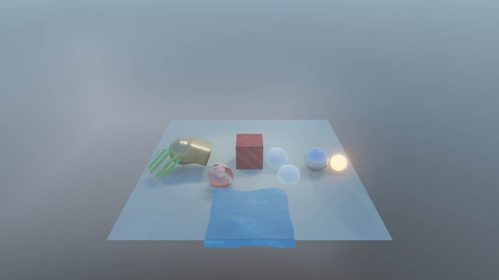

# gfxcoopa

**A header-only C++20 Vulkan library, from RAII device objects up to a deferred PBR renderer.**

gfxcoopa has two layers. The lower layer wraps Vulkan in small RAII classes with
OpenGL-style method names and sane defaults, so a window, device, swapchain and frame loop
take a few lines. The upper layer, `coopa::gfx::engine`, is a set of render passes, targets
and scene components that you combine into a full-resolution deferred PBR pipeline with
shadows, screen-space effects, volumetrics and post-processing. It runs on Linux and on
macOS through MoltenVK. [toyengine](https://github.com/cooparobla/toyengine) is one engine
built on it.

<table>
  <tr>
    <td></td>
    <td></td>
  </tr>
  <tr>
    <td colspan="2" align="center"><sub>Scenes from toyengine, which renders through gfxcoopa's deferred pipeline: PBR materials,
    refraction, SDFs, bloom and SSR (left); cascaded shadows, SSAO and TAA (right).</sub></td>
  </tr>
</table>

## Features

### Vulkan core
- **RAII everywhere.** `Instance`, `Device`, `Swapchain`, `Buffer`, `Image`, `Pipeline`,
  `CommandPool`, `Fence`, `Semaphore` and friends create in the constructor and destroy in the
  destructor.
- **One-call bring-up.** `app::Context` owns the window, instance, surface, device, VMA
  allocator, swapchain, command pool and present pass. It also handles frame timing, resizes
  and the main loop.
- **A sealed public API.** Consumers use gfxcoopa's own types (`Format`, `TextureView`,
  `SamplerDesc`, `VertexLayout`, `PipelineDesc`, `ClearColor`) instead of `Vk*` and `GLFW*`
  symbols. `tools/check_no_vulkan.sh` checks a codebase for leaks.
- **A Vulkan-free core.** Everything under `gfxcoopa/types/` compiles without Vulkan or GLFW.
  The `coopa::gfx_pure` target has no Vulkan include path, so this is enforced by the compiler.
- **Builders and helpers.** Descriptor layout and pool builders, one-shot GPU submits, staged
  image uploads, and GPU-to-PNG readback.
- **Runtime loading.** volk loads Vulkan at runtime, so nothing links `libvulkan` directly.
  VMA handles GPU memory.

### Rendering engine
- **Deferred PBR.** A G-buffer pass and Cook-Torrance lighting with directional, point and spot
  lights, an environment light and skybox, and albedo, normal, metallic-roughness and
  alpha-mask texture maps.
- **Shadows.** Directional shadow cascades (up to 4) and point/spot shadow maps, with PCF and
  PCSS filtering.
- **Indirect light.** Spherical-harmonics probe volumes (`GiSystem`, `GiBaker`), reflection
  probes with GGX-prefiltered cubemaps, and a BRDF lookup table.
- **Screen-space effects.** SSR with Hi-Z tracing and a screen-space GI bounce, GTAO-style
  SSAO, and a shared temporal history buffer.
- **Transparency.** A forward pass for alpha-blended materials, depth-tested against the
  opaque scene.
- **SDF shapes.** Raymarched signed-distance shapes that write into the G-buffer, cast
  shadows and draw forward when transparent.
- **Volumetrics and fog.** Global height fog, raymarched local volumes and a froxel-grid
  volumetric fog pass.
- **Post-processing.** Bloom, auto exposure, ACES tone mapping, colour-grading LUTs,
  thin-lens depth of field, tilt-shift, and TAA, SMAA or FXAA.
- **Optional stylisation.** `PixelStylizePass` adds outlines, ordered dithering and palette
  quantisation for projects that want them.

### Scenes and assets
- **YAML scene components.** `register_render_components()` adds parsers for `MeshRenderer`,
  `Camera`, `DirectionalLight`, `PointLight`, `SpotLight`, `EnvironmentLight`,
  `ReflectionProbe`, `GiProbeVolume`, `Volume`, `SdfRenderer` and `SdfShape` to libcoopa's
  scene loader.
- **Asset loaders.** `MeshLoader` and `TextureLoader` plug into libcoopa's `AssetManager`.
  Meshes are welded, cache-optimised and given LODs with meshoptimizer.
- **Rendering helpers.** Instanced batching, a material texture cache, samplers and skinned
  mesh data.
- **Caller-supplied shaders.** Most passes define their push-constant and descriptor layouts
  and take `.spv` paths from the caller, which owns the GLSL (toyengine ships a full set).
  `assets/shaders/` holds only the shaders gfxcoopa loads itself (GI baking, SMAA), the
  test-suite triangle, and shared headers under `assets/shaders/gfx/` (BRDF, IBL, sky, spot
  light, 2D quad vertex backbone) that consumers `#include` through the default `-I` path.

## Getting started

### 1. Clone

gfxcoopa builds on [libcoopa](https://github.com/cooparobla/libcoopa) (scene graph, assets,
input, glm, fkYAML). CMake expects libcoopa in a sibling directory named `libcoopa`. volk is a
git submodule.

```bash
mkdir coopa && cd coopa
git clone --recurse-submodules git@github.com:cooparobla/gfxcoopa.git
git clone git@github.com:cooparobla/libcoopa.git
```

If a parent project already defines the `coopa::lib` target, gfxcoopa uses that one instead.

### 2. Build

You need CMake 3.20 or newer, a C++20 compiler, the Vulkan headers and loader, `glslc`, and
GLFW. meshoptimizer is fetched by CMake on the first configure.

**Linux.** Install the Vulkan SDK (it includes `glslc`) and GLFW, then:

```bash
cd gfxcoopa
cmake -B build && cmake --build build -j
```

**macOS (Apple Silicon).** Install MoltenVK and the rest through Homebrew:

```bash
brew install cmake glfw vulkan-loader vulkan-headers molten-vk vulkan-validationlayers shaderc
cd gfxcoopa
cmake -B build && cmake --build build -j
```

The build compiles every `.vert` and `.frag` in `assets/shaders/` to a `.spv` file next to
its source. Rebuilds are incremental, and editing a shared `gfx/*.glsl` file recompiles every
shader that includes it.

### 3. Use it in your project

Add gfxcoopa as a subdirectory and link the interface target:

```cmake
add_subdirectory(path/to/gfxcoopa)
target_link_libraries(my_app PRIVATE coopa::gfx)

# Compile your own shaders. gfxcoopa's assets/shaders/ is always on the include path.
gfx_add_shader_target(my_shaders SHADER_DIR ${CMAKE_CURRENT_SOURCE_DIR}/shaders)
add_dependencies(my_app my_shaders)
```

| Target | What it is |
|---|---|
| `coopa::gfx` | The full library: headers, volk, VMA, stb, GLFW, meshoptimizer, libcoopa |
| `coopa::gfx_pure` | Only `gfxcoopa/types/`, with no Vulkan or GLFW on the include path. Use it for tests that must not touch the GPU |

### 4. Draw a triangle

```cpp
#include <gfxcoopa/app/context.h>
#include <gfxcoopa/pipeline/pipeline.h>
#include <gfxcoopa/pipeline/shader.h>

using namespace coopa::gfx;

int main() {
    app::ContextConfig config;
    config.title  = "triangle";
    config.width  = 1280;
    config.height = 720;
    app::Context ctx(app::ContextConfig::from_env(config));  // reads ONESHOT / MAX_FRAMES

    pipeline::Shader vert(ctx.device(), "assets/shaders/test.vert.spv", ShaderStage::Vertex);
    pipeline::Shader frag(ctx.device(), "assets/shaders/test.frag.spv", ShaderStage::Fragment);

    pipeline::PipelineDesc desc;
    desc.shaders     = {&vert, &frag};
    desc.raster.cull = CullMode::None;
    desc.depth.test  = false;  // the swapchain pass has no depth attachment
    desc.depth.write = false;
    pipeline::Pipeline triangle(ctx.device(), ctx.render_pass(), desc);

    app::FrameCallbacks frame;
    frame.clear  = ClearColor{0.05f, 0.05f, 0.08f, 1.0f};
    frame.record = [&](command::CommandBuffer& cmd) {
        Extent2D ext = ctx.extent();
        cmd.bind_pipeline(triangle);
        cmd.set_viewport(0, 0, float(ext.width), float(ext.height));
        cmd.set_scissor(0, 0, ext.width, ext.height);
        cmd.draw(3);
    };

    ctx.run(nullptr, frame);  // poll, update, draw, until the window closes
}
```

`test.vert` hard-codes its three vertices, so no vertex buffer is needed. For geometry, set
`desc.vertex` to a `VertexLayout` and bind a `memory::Buffer`. For a hidden window (for
example in automated runs), set `config.visible = false`; rendering and presentation still
work.

## Testing

```bash
ctest --test-dir build                 # every suite, in parallel (labels: unit, gpu)
ctest --test-dir build -L unit         # only the suites that need no Vulkan device
./build/gfxcoopa --suite compute       # one suite, run from the repo root
```

The tests live in `tests/`, one suite per system in `tests/<suite>_test.cpp`, written against
libcoopa's `coopa/testing/test.h` framework and linked into the `gfxcoopa` executable; each
suite is its own ctest entry (`gfxcoopa_<suite>`). `vk_util`, `camera`, `material` and
`surface_shader_registry` need no device (label `unit`). `resource_transfer`, `compute`,
`textured_quad_pass` and `presentation` bring up a Vulkan device per test through
`tests/support/gpu_fixture.h` (label `gpu`): buffer/image transfers and readback, compute and
indirect dispatch, the descriptor cache, `Context`, the renderer and swapchain resize. They load
the `assets/shaders/test*` shaders by relative path, so run them from the repository root (ctest
does). Every window they create is hidden, and the Khronos validation layer is enabled (install
it so validation errors surface). The tests are only built when gfxcoopa is the top-level
project, not when another repo pulls it in with `add_subdirectory()`.

## Project layout

```
gfxcoopa/
├── app/           Context: window-to-swapchain bring-up and the main loop
├── core/          Instance, Surface, Device, Swapchain
├── memory/        Allocator (VMA), Buffer, Image, staged image upload
├── pipeline/      Shader, ShaderLibrary, RenderPass, descriptors, Pipeline
├── command/       CommandPool, CommandBuffer, Fence, Semaphore
├── presentation/  Window (GLFW), Renderer (acquire, record, submit, present)
├── util/          error checks, volk init, debug messenger, format helpers, image readback
├── types/         Vulkan-free vocabulary: Format, SamplerDesc, VertexLayout, TextureView, ...
├── detail/        internal Vk/GLFW conversions; not for consumers
└── engine/
    ├── components/  scene components and register_render_components()
    ├── data/        Mesh, Texture, camera/light/fog/volumetrics UBOs, LUTs
    ├── targets/     G-buffer, offscreen, shadow-map, cubemap targets
    ├── passes/      every render pass, built on the shared FullscreenStage
    ├── gi/          SH probe baking, GiSystem, BRDF LUT
    ├── loaders/     AssetManager loaders for meshes and textures
    └── util/        samplers, instance batcher, texture cache, SMAA textures, SH math
assets/shaders/  GI, SMAA and test shaders; gfx/ holds the shared GLSL headers
cmake/           GfxShaders.cmake (gfx_add_shader_target)
includes/        vendored volk (submodule), VMA, stb_image
src/             gfx_impl.cpp: the single TU that compiles volk/VMA/stb implementations
tools/           check_no_vulkan.sh
tests/           test suites (<suite>_test.cpp) and the shared GPU fixture (support/)
```

## Platform notes

- **macOS.** Instance creation enables portability enumeration and the device enables
  `VK_KHR_portability_subset` when MoltenVK reports it. volk looks for the loader in
  `$VULKAN_SDK/lib`, `/opt/homebrew/lib` and `/usr/local/lib`. Window and framebuffer sizes
  differ on Retina displays, so size render targets from `ctx.extent()` (framebuffer pixels).
- **Present modes.** `vsync = true` (the default) uses FIFO. With `vsync = false` gfxcoopa
  prefers MAILBOX and falls back to FIFO. MoltenVK has no MAILBOX, so it is always FIFO there.
- **Validation.** `ContextConfig::validation` defaults to `true`. If the Khronos validation
  layer is not installed, `Instance` logs a warning and continues without it. Set it to
  `false` to skip the layer.
- **SMAA.** `engine/util/smaa_textures.h` includes `SearchTex.h` and `AreaTex.h` from the
  [SMAA reference implementation](https://github.com/iryoku/smaa). They are not vendored.
  If you use `SmaaPass`, pass `-DSMAA_TEXTURES_DIR=/path/to/smaa/Textures`.
- **Implementation TU.** `gfxcoopa_impl` compiles the volk, VMA and stb implementations once.
  Do not define `VOLK_IMPLEMENTATION`, `VMA_IMPLEMENTATION` or `STB_IMAGE_IMPLEMENTATION` in
  your own code.

## Documentation

- Module READMEs: [overview](gfxcoopa/README.md), [core](gfxcoopa/core/README.md),
  [memory](gfxcoopa/memory/README.md), [pipeline](gfxcoopa/pipeline/README.md),
  [command](gfxcoopa/command/README.md), [presentation](gfxcoopa/presentation/README.md),
  [util](gfxcoopa/util/README.md), [engine](gfxcoopa/engine/README.md).
- Every header carries Doxygen comments. `coopadocs build` generates an HTML API reference
  into `.docs/`.
